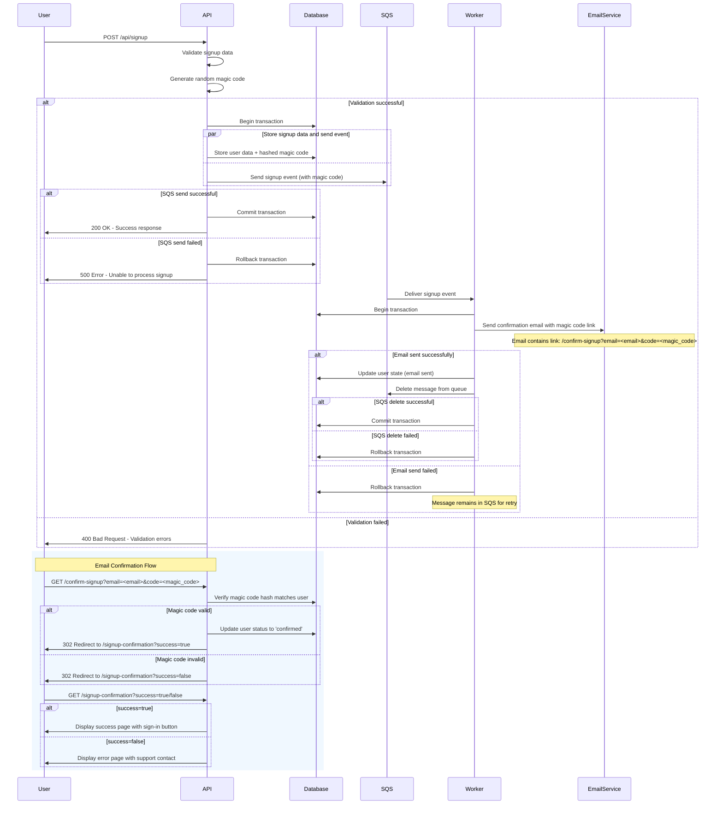
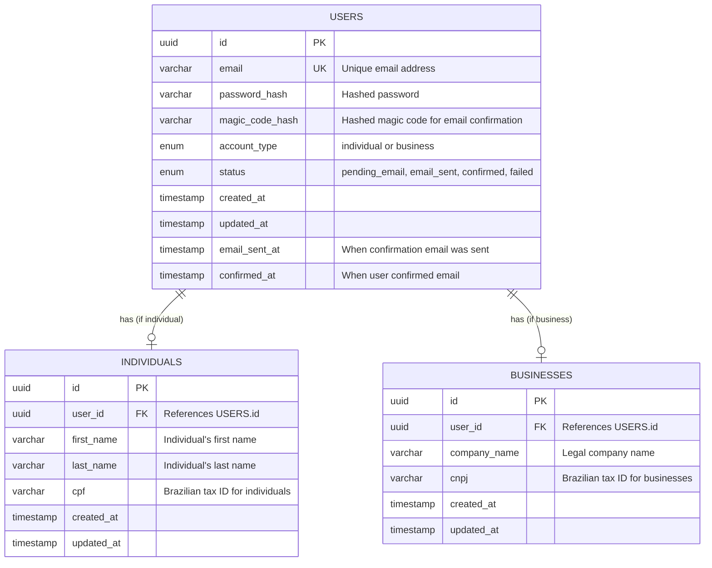

# Signup Flow Architecture

This document describes the architecture for the user signup flow, which involves concurrent database operations and asynchronous email processing.

## Overview

The signup process is designed to handle user registration with transactional integrity and reliable email delivery through an event-driven architecture.

## Architecture Diagram

## Key Components

### Backend API
- Validates incoming signup requests
- Manages database transactions
- Publishes events to SQS concurrently with database operations
- Ensures transactional integrity by rolling back on SQS failures

### Database
- Stores user signup data
- Maintains user state (pending email confirmation, confirmed, etc.)
- Supports transactions for data consistency

### SQS (Simple Queue Service)
- Receives signup events from the backend
- Provides reliable message delivery to workers
- Handles message retry logic for failed processing

### Worker
- Processes signup events from SQS
- Sends confirmation emails to users
- Updates user state in database upon successful email delivery
- Deletes processed messages from SQS

### Email Service
- Handles actual email delivery
- Includes magic code confirmation link in email content
- Returns success/failure status to worker

## API Endpoints

### POST /api/signup
- Validates signup data (individual or business)
- Generates random magic code
- Stores user data and hashed magic code in database
- Sends signup event to SQS queue
- Returns success/error response

### GET /confirm-signup?email=&lt;email&gt;&code=&lt;magic_code&gt;
- Validates magic code against stored hash for the given email
- Updates user status to 'confirmed' if valid
- Redirects to signup-confirmation page with success/failure status

### GET /signup-confirmation?success=true/false
- **success=true**: Displays confirmation success message with sign-in button
- **success=false**: Displays error message asking user to check email link or contact support

## Email Confirmation Flow

1. **Magic Code Generation**: API generates cryptographically secure random code
2. **Code Storage**: Hash of magic code is stored in database (never plain text)
3. **Email Content**: Confirmation email contains link: `/confirm-signup?email=<email>&code=<magic_code>`
4. **Code Verification**: When user clicks link, API hashes provided code and compares with stored hash
5. **Status Update**: Valid codes trigger user status change to 'confirmed'
6. **User Feedback**: User is redirected to appropriate success/error page

## Error Handling

1. **Validation Errors**: Return 400 Bad Request immediately
2. **SQS Failures**: Rollback database transaction and return 500 error
3. **Email Failures**: Leave message in SQS for automatic retry, do not update user state
4. **Invalid Magic Code**: Redirect to error page with instructions to check email link
5. **Expired/Missing Codes**: Treated as invalid codes

## Database Schema

The following ER diagram illustrates the user tables that support the signup flow:

### Status Column Values

- **pending_email**: User registered, waiting for email to be sent
- **email_sent**: Confirmation email has been sent to user
- **confirmed**: User has confirmed their email address
- **failed**: Email sending failed (for monitoring/retry purposes)

### Table Relationships

- Each user can have either an individual profile OR a business profile (not both)
- The `account_type` field in USERS determines which related table contains the profile data
- Individual accounts link to the INDIVIDUALS table with personal information
- Business accounts link to the BUSINESSES table with company information
- Status tracking enables the worker to update user state after successful email delivery

## Transactional Integrity

The system ensures that either both the database write and SQS event succeed, or both fail. This prevents inconsistent states where user data is stored but no email confirmation process is triggered.
